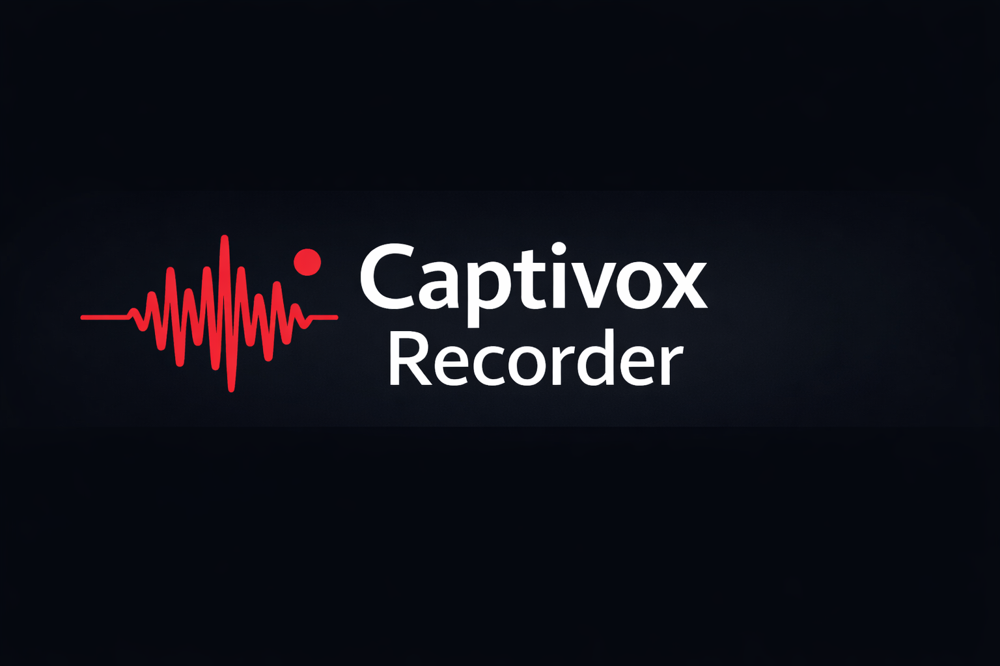

# Captivox Recorder

**Beta – 0.9.0-beta1**  
Captivox Recorder is a local Windows meeting recorder with a session‑folder workflow and an offline transcription pipeline. It captures microphone and system audio, writes a structured session folder, and hands off to a worker process for WhisperX‑based transcription. All audio and transcripts remain on your machine.

## What's new

The core recording and transcription workflow is fully functional and free to use. If you find Captivox valuable, please consider supporting development via [donations](https://www.paypal.com/donate/?business=J8L5Z2UP4K6HL&no_recurring=0&currency_code=EUR).

## Key features

- **Local-first**: recordings and transcripts stay on your computer.
- **Microphone & system audio capture**: record both sides of your meetings.
- **Session folder output**: each recording is stored in its own folder with predictable artifacts.
- **Structured handoff**: a `READY` marker signals to a worker to start transcription.
- **Offline transcription**: uses WhisperX with optional diarization for accurate speaker labels.

## Installation

- **Installer**: Download the latest installer from the [releases](https://github.com/rgerr/captivox-recorder/releases) page. Run the installer and follow the on‑screen prompts.
- **Source code**: The source code is not published in this repository. Please use the installer for now.

## Roadmap

- Finalize the session library, tagging and filtering.
- Signed installer and automatic updates.
- AI-assisted summaries and library chat.
- Cross-platform support.

## Contributing

Contributions are welcome! Please open issues or pull requests for bugs and enhancements. Before contributing code, run `install-prereqs.ps1` and `build-win-x64.ps1` to reproduce the build environment.

## Donations

Captivox is a passion project. If you find it useful, please support development via [PayPal](https://www.paypal.com/donate/?business=J8L5Z2UP4K6HL&no_recurring=0&currency_code=EUR). Your support helps cover costs and accelerates new features.

## Security

For security issues or vulnerability reports, please contact our security team via the e‑mail listed in [SECURITY.md](SECURITY.md).

## License and usage

This code is provided for evaluation and collaboration under a proprietary license. Redistribution or commercial use requires permission from the authors.
